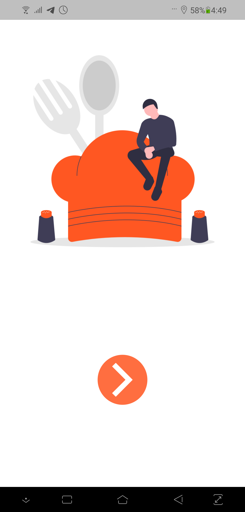
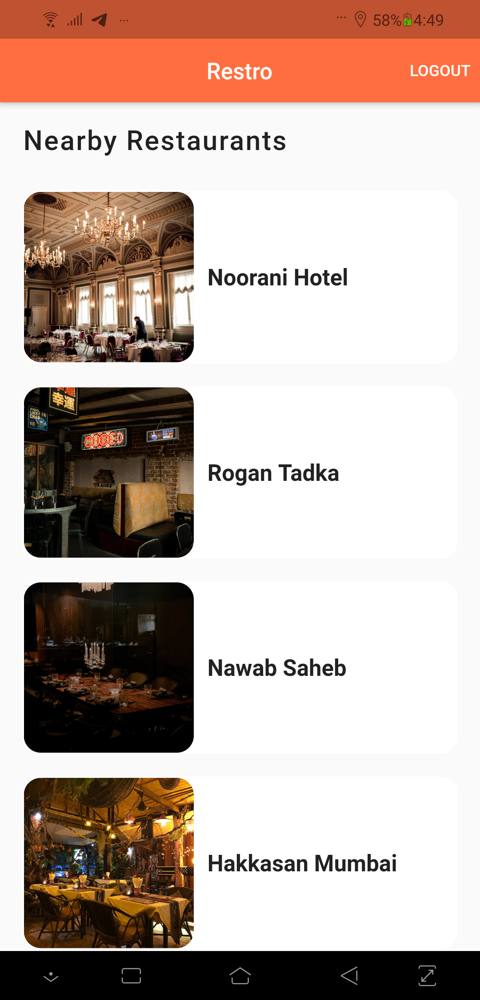
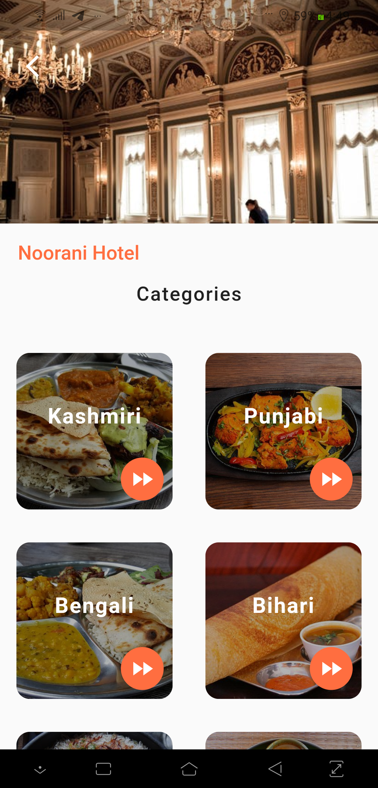
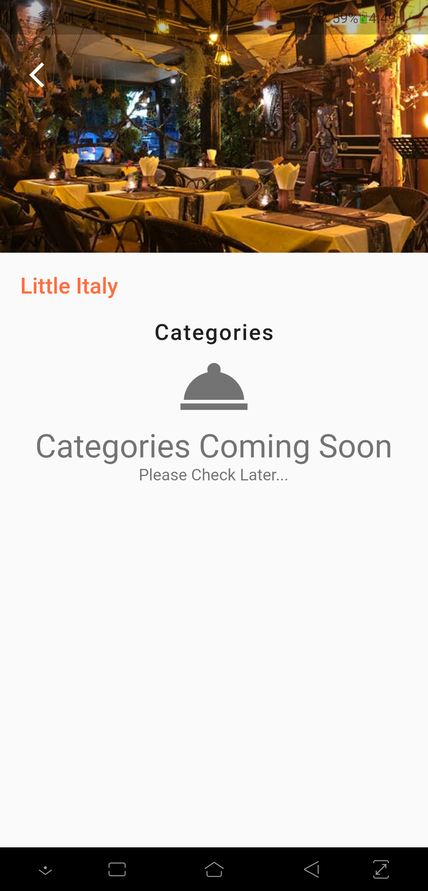
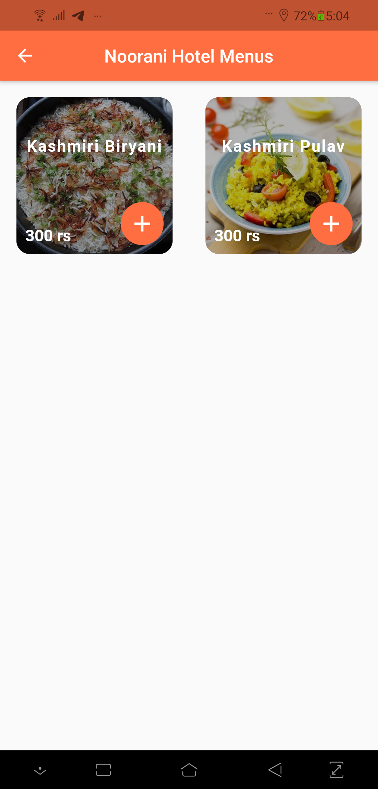
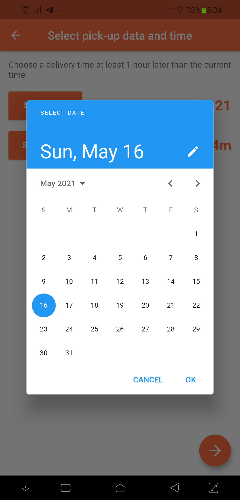
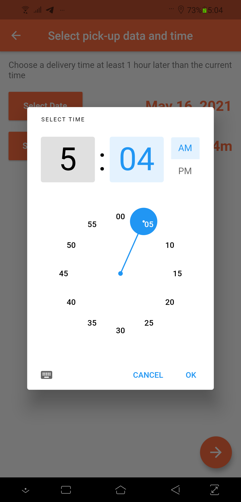
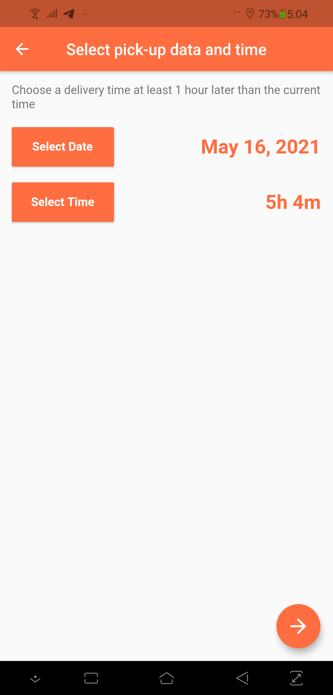
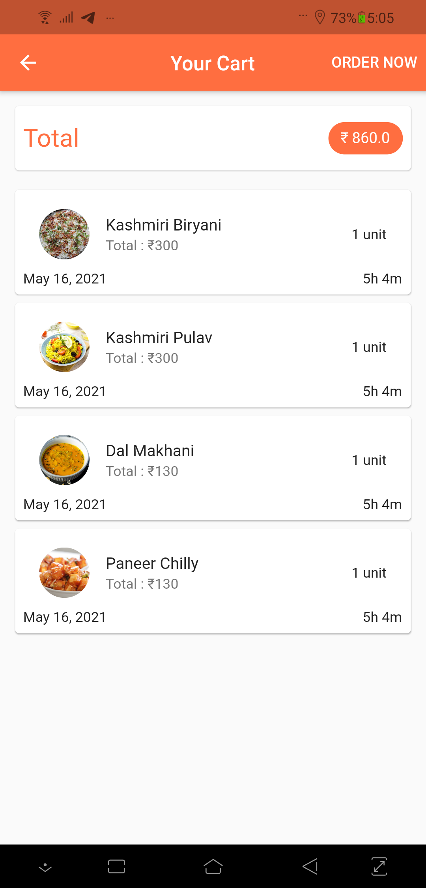
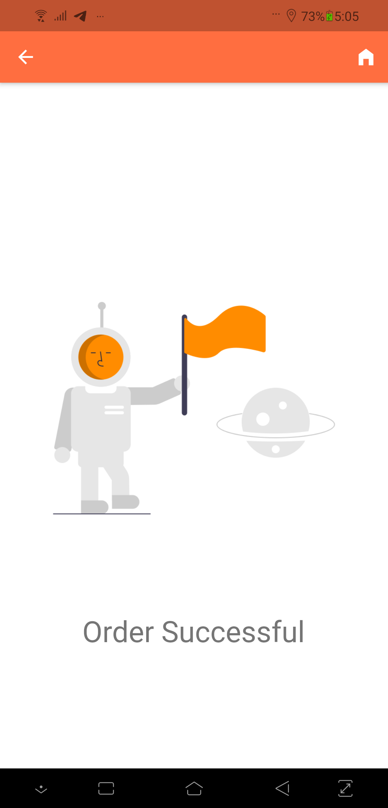

# Restro

> Restro fetches all restaurants with in **20 miles** available in database using user's location, shows categories and menus for each 
> restaurants and also allow to order food from given menu.

  

> Restro is an android application built using **Flutter** and **Firebase**.

  

> A glimpse of **Restro**.

 ## Anonymous Sign in

    

  

## Nearest Restaurants.

    

  

## Restaurants Categories.

    

  

## If restaurant doesn't have categories.

    

  

## Restaurant Menus.

    

  

## Select Date.

    

  

## Select Time.

    

  

## Selected Date and Time.

    

  

## Your Carts.

    

  

## Order Success

    

  
